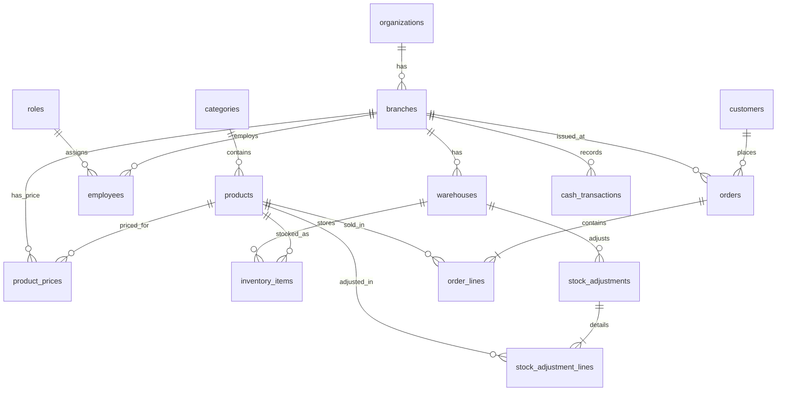

# Sơ Đồ Thực Thể Quan Hệ (ERD) - Physical Database

Sơ đồ này biểu diễn các bảng cốt lõi và khóa ngoại vật lý (Physical Foreign Keys) trong cơ sở dữ liệu PostgreSQL.

*(Lưu ý: Bảng `cash_transactions` có các trường `reference_type` và `reference_id` đóng vai trò là Polymorphic Association (Liên kết động) trỏ đến `orders` hoặc `purchase_orders` mà không dùng Physical FK trực tiếp để tăng tính linh hoạt).*
